# Haas HTS400 Diameter-Wear Postprocessor Tweaks

This guide outlines how the postprocessor on the Haas HTS400 tool presetter can be modified to emit diameter wear instead of diameter geometry, in addition to other useful information that can be consumed by the Haas Next Generation Controller (NGC). This author owns several Haas Automation machines and other shop equipment, but has no relationship with Haas Automation Inc. Use of this guide is entirely at the reader's risk.

TL;DR: Copy the [modified post-processor](./11_Haas_NGC_rev1_ofs.pp) to a USB stick and use the software-update button to add it to the HTS.

## Motivation

The [Haas HTS400](https://www.haascnc.com/haas-tooling/tool_management/tool_presetting_mach/08-1200.html) is an entry-level, camera-based tool presetter. This guide will not attempt to cover the operation of the HTS, since that is covered by an [in-depth video](https://youtu.be/T0yI9VcaKgw) and on-device help. The HTS has multiple ways to export tool geometry, either though the use of barcode stickers or by transferring offset files over the network. This guide will focus on the latter approach, since the offset files can transfer a richer collection of information about a tool.

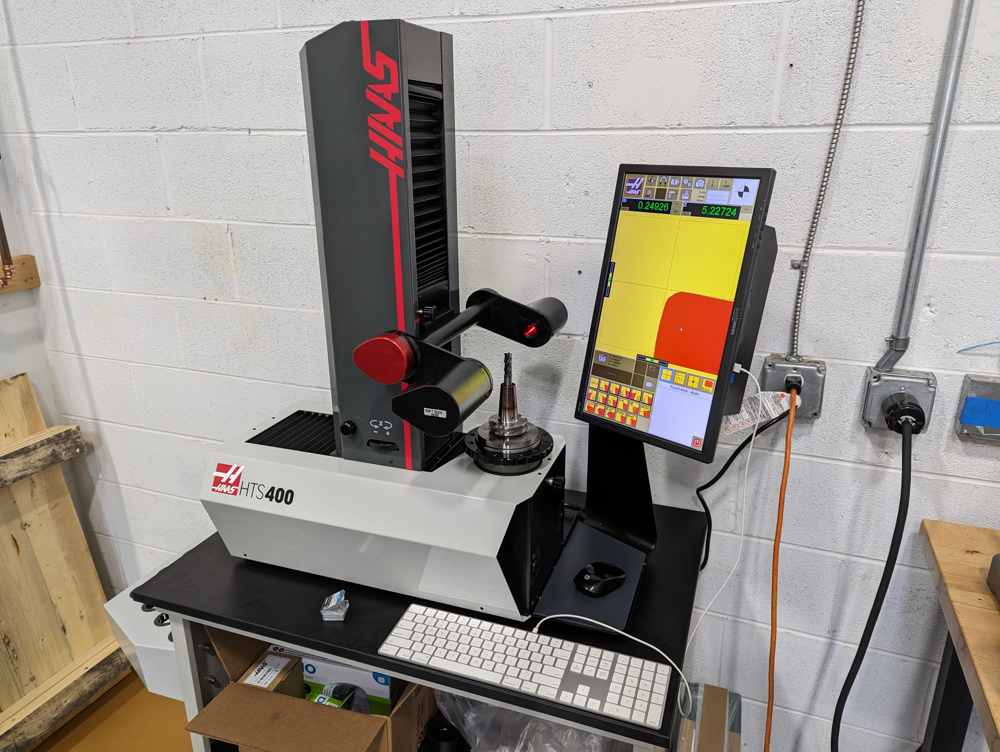

Programming `G41` cutter compensation in Diameter versus Wear is a bit of an Internet holy war, but it suffices to say that this author prefers the smaller lead-in moves that wear compensation provides, tries very hard not to do math, or to juggle too many values in the control offsets page. The HTS's default postprocessor for the NGC emits offset files that look like the following:

```xml
<TOOL_OFFSET>
          <TOOL1> 
               <ID>03-0549</ID>
               <DESCRIPTION>4F 0.030R</DESCRIPTION>               
               <LENGTH_GEOMETRY>131.838</LENGTH_GEOMETRY>
               <LENGTH_WEAR>0.0</LENGTH_WEAR>
               <DIAMETER_GEOMETRY>12.720</DIAMETER_GEOMETRY>
               <DIAMETER_WEAR>0.0</DIAMETER_WEAR>
          </TOOL1>
</TOOL_OFFSET>
```

## Tool definitions 

The HTS software provides a number of fields beyond tool length and diameter that includes a theoretical diameter.

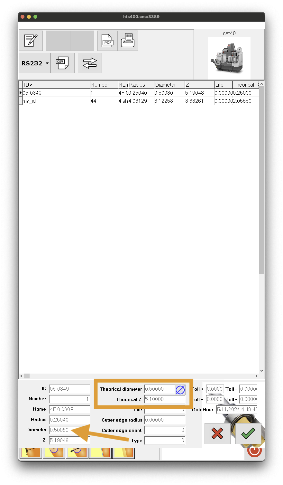

Specifically, we want to focus on being able to define a nominal tool diameter that matches the tool diameter used in CAM, and have the HTS emit the following:

```xml
<TOOL_OFFSET>
          <TOOL1> 
               <ID>03-0549</ID>
               <DESCRIPTION>4F 0.030R</DESCRIPTION>               
               <LENGTH_GEOMETRY>131.838</LENGTH_GEOMETRY>
               <LENGTH_WEAR>0.0</LENGTH_WEAR>
               <DIAMETER_GEOMETRY>0.0</DIAMETER_GEOMETRY>
               <DIAMETER_WEAR>0.020</DIAMETER_WEAR>
               <ACTUAL_DIAMETER>12.720</ACTUAL_DIAMETER>
               <APPROX_DIAMETER>12.7000000</APPROX_DIAMETER>
               <APPROX_LENGTH>129.5</APPROX_LENGTH>
               <COOLANT_POSITION>25</COOLANT_POSITION>
          </TOOL1>
</TOOL_OFFSET>
```

You can see an exhaustive collection of fields by exporting the NGC control's tool table and opening the resulting `.ofs` file.
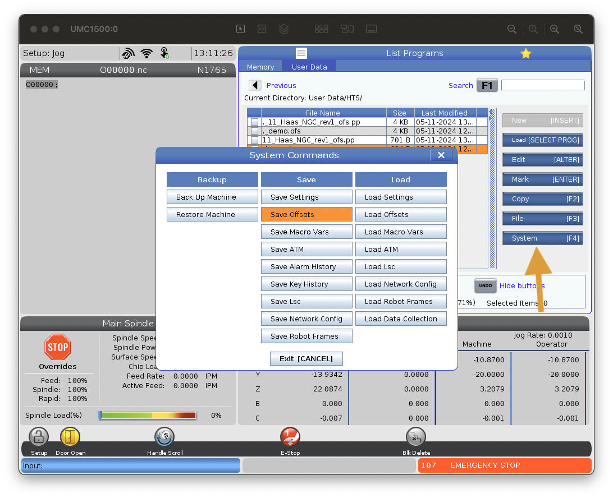

## HTS400 internals

The HTS runs a stripped-down version of Windows 10 which means that it has good networking and remote-access support.  By attaching a keyboard to the unit and hitting the Windows key, the user can navigate away from the presetter UI and explore the underlying system.

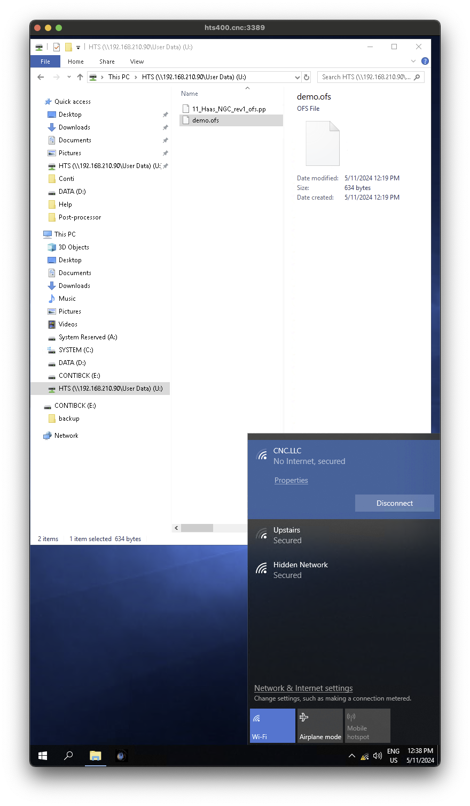

In this case, the HTS is attached to the workshop's Wi-Fi and has mounted an NGC's fileserver as the `U:` drive. The contents of the `D:` drive are of particular note, since this is where the postprocessor definitions are stored.

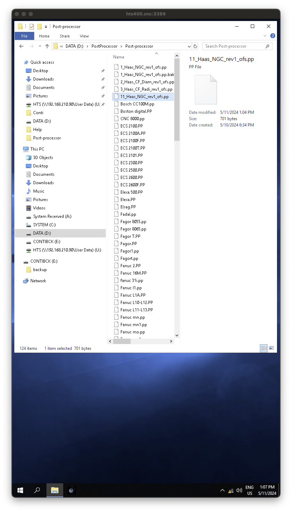

The infinite variety of CNC controls from many different manufacturers means that the presetter software, just like a CAM package, needs a great deal of flexibility in converting the measured tool geometries into G-Code or other file formats. The HTS software includes an integrated editor for the postprocessor files, or you can side-load a modified postprocessor via USB or network connection. The orange arrow below shows the icon to open the postprocessor editor from within the bulk-export UI.

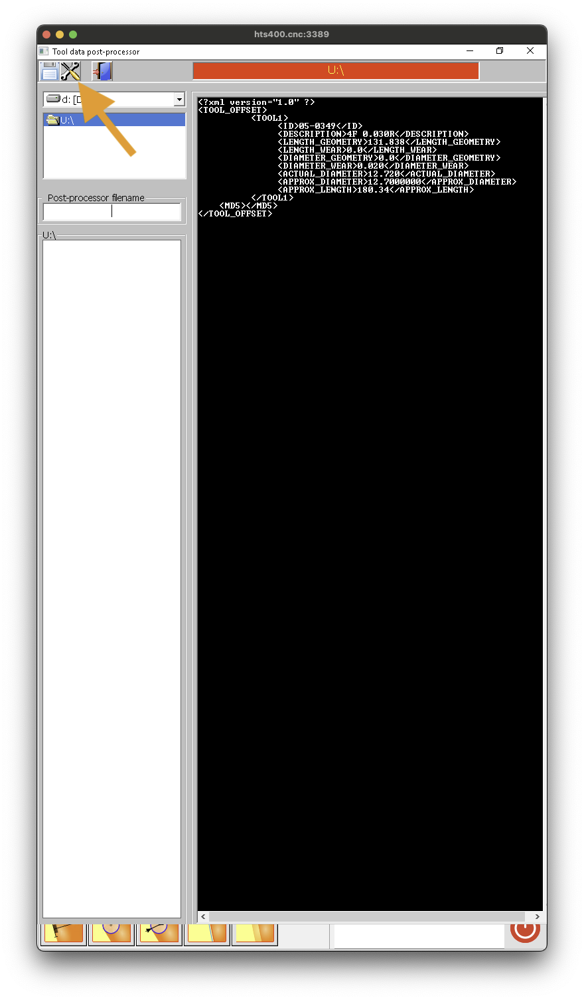

The editor is basic, but it allows you to preview the output (magnifying glass icon) and save your edits to the postprocessor file.  Notably missing is a Save-As feature, so be sure to make a copy of your base file before starting.

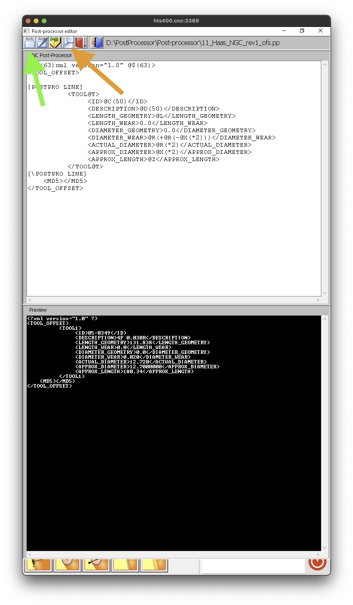

## Postprocessor 

Within any given postprocessor file, we see various `@`-markers that substitute values into the output. Through exhaustive experimentation, the `@X` and `@Z`  parameters are found to contain the approximate radius and length.  There's also a fairly basic expression language available to manipulate the values. This doesn't appear to be documented anywhere, but examination of other files and hoping that the parser has some kind of recursive descent behavior leads to the following:

`<DIAMETER_WEAR>@R(+@R(-@X(*2)))</DIAMETER_WEAR>`

We double the measured radius `@R` and subtract twice the theoretical radius `@X`. The NGC offsets page also has an "Actual Diameter" field that drives the SFM display, as well as "Approximate Length" and "Approximate Diameter" fields to pre-populate VPS templates. We'll include these using the `@X` and `@Z` variables.  It's also nice to include a default position for a P-Cool nozzle.  That leads to the following modifications:

```
<LENGTH_GEOMETRY>@L</LENGTH_GEOMETRY>
<LENGTH_WEAR>0.0</LENGTH_WEAR>
<DIAMETER_GEOMETRY>0.0</DIAMETER_GEOMETRY>
<DIAMETER_WEAR>@R(+@R(-@X(*2)))</DIAMETER_WEAR>
<ACTUAL_DIAMETER>@R(*2)</ACTUAL_DIAMETER>
<APPROX_DIAMETER>@X(*2)</APPROX_DIAMETER>
<APPROX_LENGTH>@Z</APPROX_LENGTH>
<COOLANT_POSITION>25</COOLANT_POSITION>
```

The Haas offsets file also includes an integral checksum. This is not calculated by the post-processor, but instead appears to be a post-post-processor step. This calculation remains opaque, but the export process doesn't mind the extra fields.

## Validation

As noted previously, the `U:` drive is set up to connect to a network mount. A USB stick could be used instead. With the machine in E-Stop, the `.ofs` file can be loaded via `[SELECT PROG]` . The "Disk Done" message indicates success.

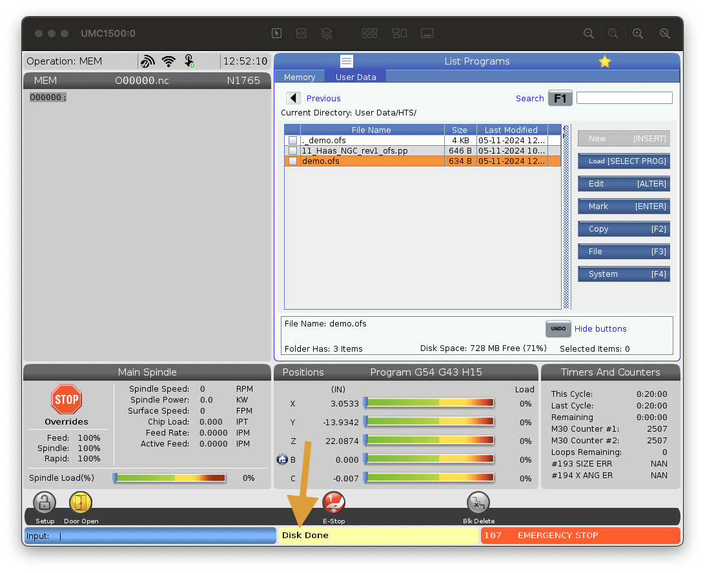

We can see that the offsets page has been updated:

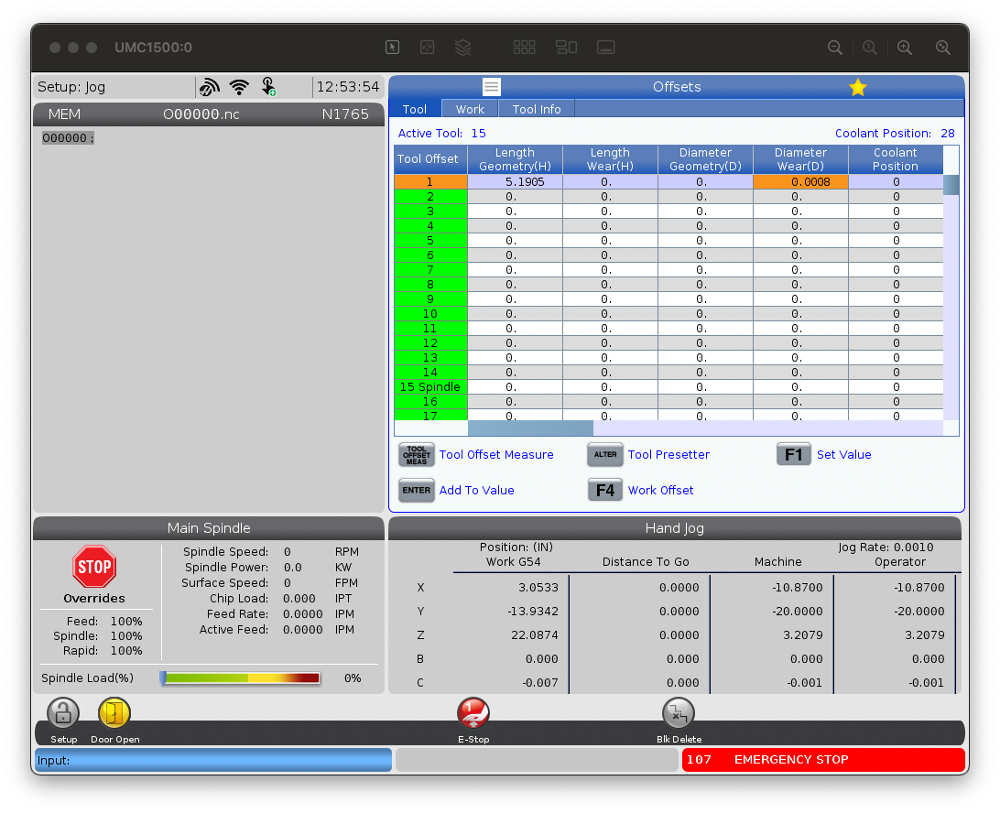
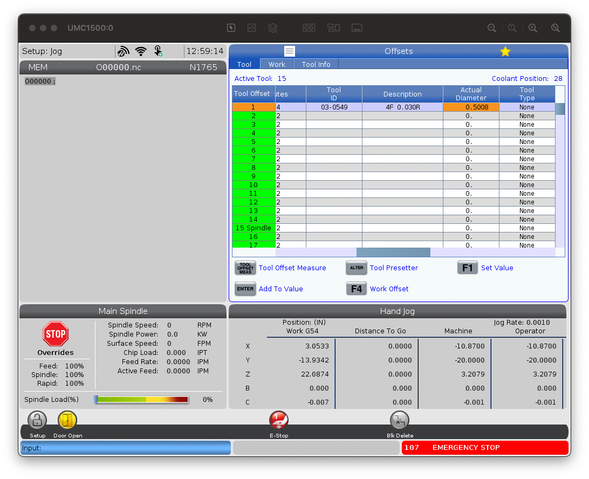

## Future work

There isn't a field in the HTS software to enter the number of flutes to make the chip load display accurate, but another hack would be to always use the first two characters of the description field. In this demo the description could have been set to `04F 0.030R` with the following added to the postprocessor:

`<FLUTES>@D(2)</FLUTES>`

This would substitute the first two characters of the description into the `.ofs` file. Without knowing more about the postprocessor expression language in order to provide a sane-default, this would require extra rigor when entering tool descriptions to ensure consistent behavior.

The barcodes printed by the HTS do include Wear fields, but examination of the presetter binary shows that they're hard-coded to 0 in a string constant. The DataMatrix barcode format is easy to encode. A bit of future work may be to convert a populated `.ofs` file into a number of stickers to be printed at once.

It would be interesting to see if the postprocessor's expression language is robust enough to re-implement the [PCool Auto Set](https://www.haascnc.com/content/dam/haascnc/videos/bonus-content/ep44-p-cool/pcool_set.nc) program. There do appear to be some kind of macro-variables in the processor language that could be used to tweak the output on a per-machine basis.

## Other NGC tricks

The NGC has an integrated SMB (Windows) file server as well as an [integrated VNC server](https://youtu.be/ye1m8Y_LmXU).

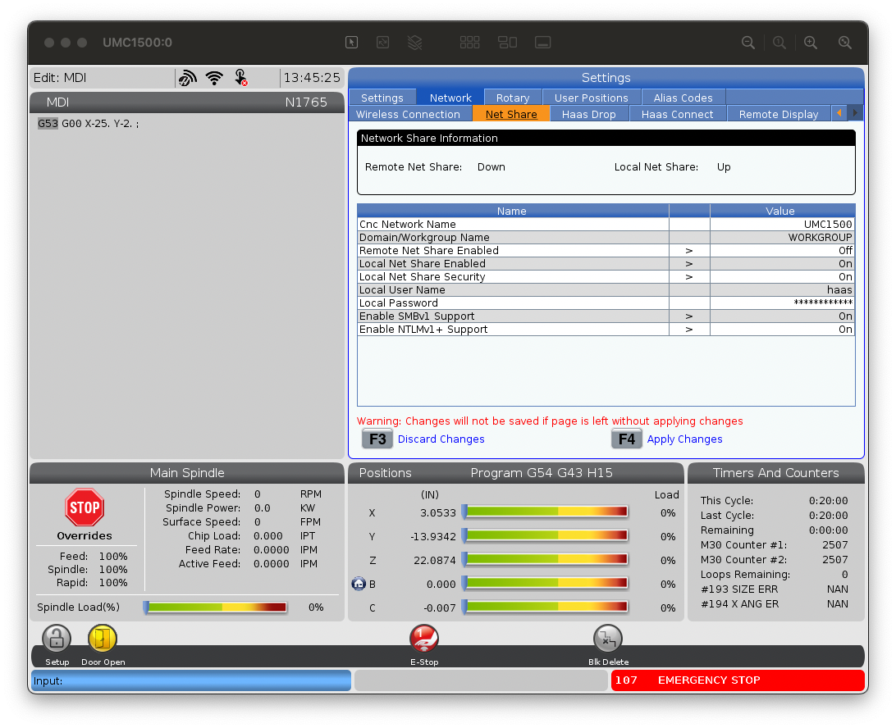
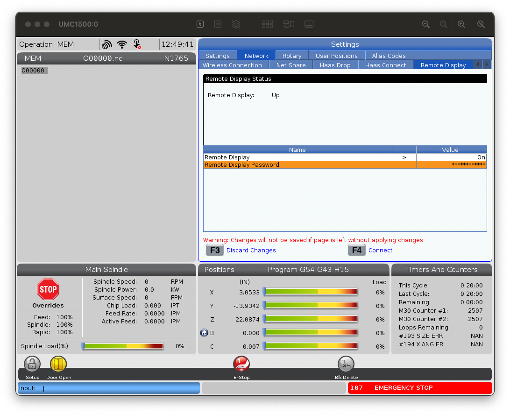

## Contact Info

You can reach the author, Bob Vawter, who wanted to design his own laptop stand and who now owns a pocket machine shop in the Northern Virginia area, by emailing `bob@CNC.LLC` 

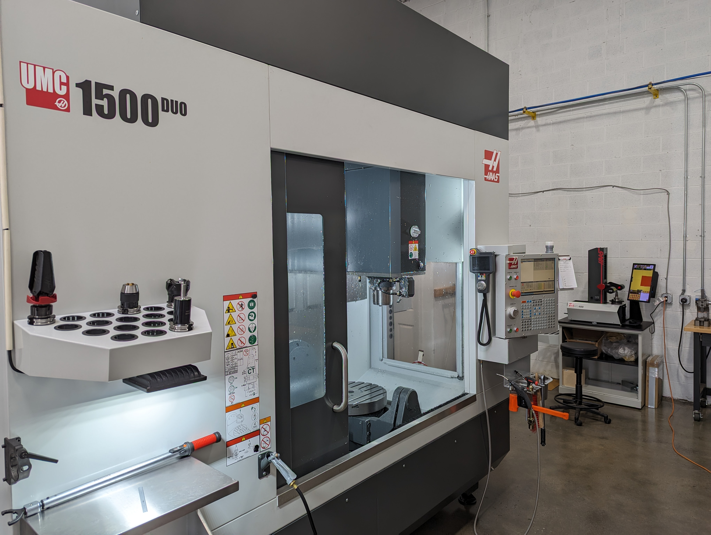
